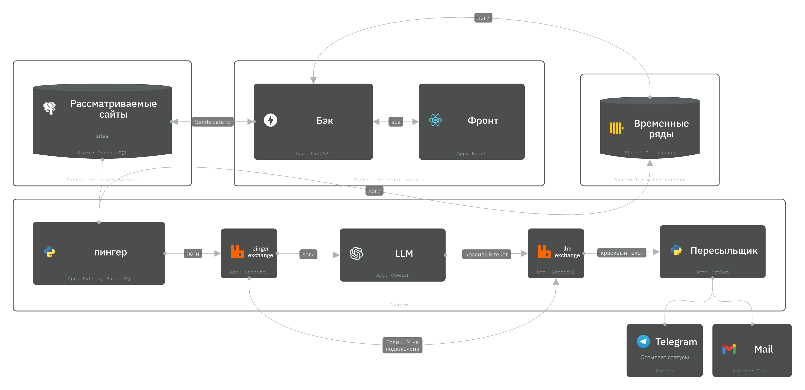

# [PingTower](siada.ru)
**User-friendly инструмент мониторинга состояния сервисов**

`PingTower` отслеживает активность сторонних сервисов и, когда случается сбой, анализирует его при помощи нейросети и сообщает пользователям понятную информацию о сбое по различным каналам связи - `Telegram`, `Mail` и др.

## Схема
Проект декомпозирован на микросервисы, сообщающиеся посредством брокера сообщений RabbitMQ. [Логическая схема](https://s.icepanel.io/34N6PW8TrEZsle/Mpsl/landscape/diagrams/viewer?diagram=8q6WHcjX1g&model=GH1iRRA7xV&overlay_tab=technology&x1=-411.3&x2=2242.1&y1=-371.1&y2=1385.7) работы сервиса выглядит следующим образом:



## Преимущества микросервисной архитектуры
- Cервис **легко масштабируется**. При высокой нагрузке мы можем арендовать еще серверы и легко настроить балансировщик нагрузки
---
- Сервис **легко разворачивать**, в том числе и на разных системах. Это ощутимо экономит ресурсы команды разработки и обсеспечивает удобство при maintain-поддержке сервиса
---
- Ресурсы микросервисов изолированы. Это значит, что потенциальная **ошибка** в одном микросервисе **не приведёт к поломке** сервиса целиком
---
- Сервис **легко развивать**. Внедрять новый функционал проще засчет модульности сервиса


## Микросервисы

### [RabbitMQ](compose.yml)
`RabbitMQ` - брокер сообщений. В нём определены очереди (`queue`) - "тоннели", по которым коммуницируют микросервисы

`RabbitMQ` предлагает удобный интерфейс для отладки: 

### [broker](broker)
Декларирует очереди и эксченджи (`exchange`) - инициализирует инфраструктуру для брокера сообщений

### [pinger](pinger)
С заданной частотой проверяет определенные пользователем ресурсы: HTTP-статус, редиректы, latency, DNS, TLS/SSL (включая срок действия)

### [LLM_service](LLM_service)
Превращает технические логи в ёмкий человекочитаемый отчет об инциденте

### [web](web)
Интерфейс взаимодействия пользователя с сервисом

### [backend](backend)
Более низкоуровненый интерфейс взаимодействия пользователя посредством `web` с сервисом

### [notifier-service](notifier-service)
Присылает аккуратные и своевременные уведомления пользователям бота в `Telegram`

### [database](database)
Хранит информацию о юзерах, опрашиваемых сервисах и старых логах

[Cхема таблиц](https://dbdiagram.io/d/68cb424c5779bb7265f9f2aa) базы данных выглядит следующим образом:


### [clickhouse](clickhouse)
База данных для свежих логов. Необходима для оптимального и быстрого построения дашбордов. Через месяц логи считаются "старыми" и переносятся в `PostgreSQL`

### [archiver](archiver)
Перекладывает давние логи из `ClickHouse` в `PostgreSQL`

## Деплой
### 1) Установка зависимостей

- Установите `Docker` (или `Docker Desktop` - для `macOS`)


### 2) **Проброс сети Docker'а**
   
 ```bash
 docker network create broker_network
 ```

### 3) **Запуск проекта**

 В корневой директории

```bash
docker-compose up --build
 ```
