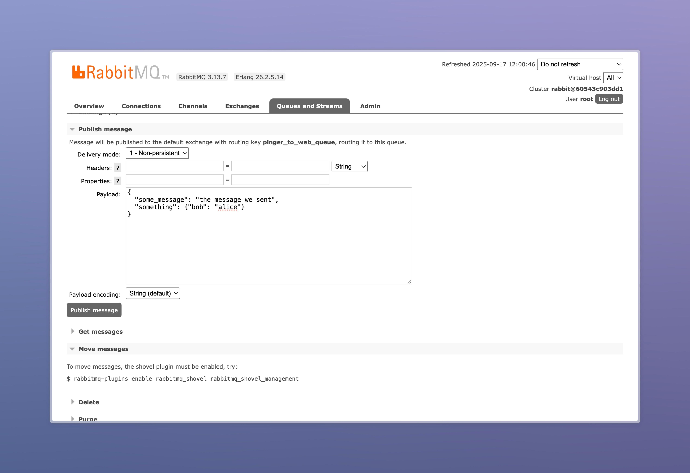

# О проекте
TODO - нормально эту часть написать
Проект чето там микросервисная архитектура, чето там ллм, чето там брокер сообщений и стрессоустойчивость и кайф и автоматизированный деплой и кайф ещё раз

Состоит из следующих микросервисов:
## broker_service
Декларирует очереди и exchange'ы - настраивает брокер сообщений

## example_service
Является шаблоном (примером) коммуникации между сервисами. Содержит пример сабскрибера и паблишера


# Деплой
## 1) Установка зависимостей

- Установите `Python 3.11` (например, через `pyenv`)
- [Установите](https://python-poetry.org/docs/#installation) `Poetry`
- Установите `Docker` (или `Docker Desktop` - для `macOS`)


## 2) **Проброс сети Docker'а**
   
 ```bash
 docker network create broker_network
 ```

## 3) **Запуск проекта**

 В корневой директории

```bash
docker-compose up --build
 ```

# Если есть желание потыкать

В браузере откройте [страницу отслеживания очередей](http://localhost:15672/#/queues/%2F/pinger-to-web-queue)

- Логин: `root`

- Пароль: `toor`

Опубликуйте сообщение
```json
{
  "some_message": "the message we sent",
  "something": {"bob": "alice"}
}
```

в поле ввода:

Сообщение появится в логах
```
example_service  | 2025-09-17 09:17:52,542 [INFO] root: Got message: some_message='the message we sent' something={'bob': 'alice'}
```